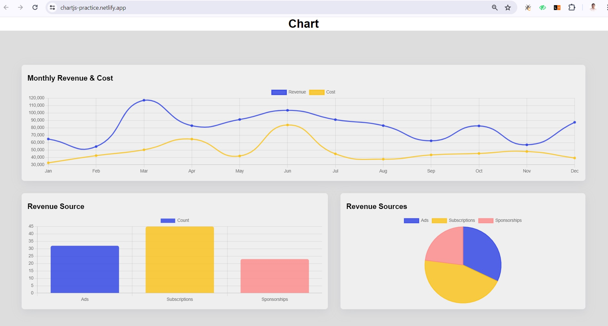

# Charts:
**Live Link:** 
[click here](https://chartjs-practice.netlify.app/)

## Introduction:
- This repository consist of the basic practice code for the Chart.js
- Here, I am trying to cerate the bar, line and pie chart with the help of chartJs and react-chartjs-2 libraries.
## Tech Stack Used:
- React, ChartJS, HTML,CSS and JS
## Snaps: 
- snap of the Static website
